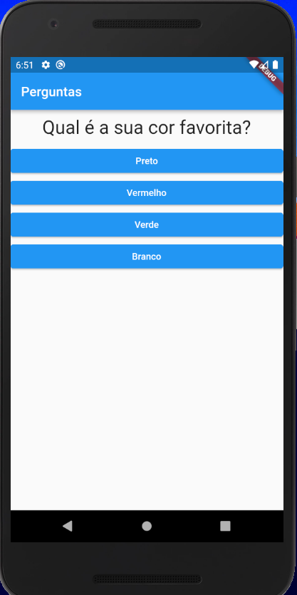
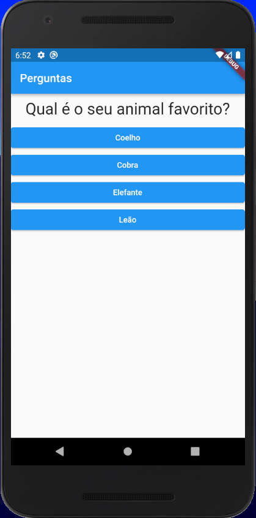
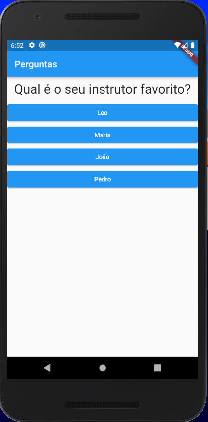
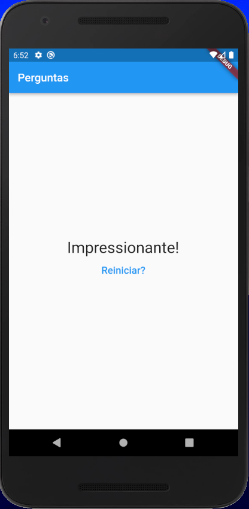
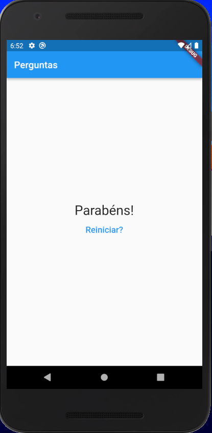

<h1> Projeto de receitas em Flutter <h1> 

  > Status: Concluido ✔️
  
  ### Projeto finalizado em flutter através do curso da Udemy. Esse projeto é uma lista com várias perguntas e de acordo com o que você selecionar vai dar um resultado diferente.
  
  <strong>Principais caracteristicas do projeto: </strong>
  
  + Listas 
  + Várias paginas
  + Opção de reniciar
  + finais alternativos de acordo com o quer você selecionar
  
  <strong>Tecnologias usadas: </strong>
   + Flutter
  
  
   ### Imagens do projeto
   
  
&nbsp;&nbsp;&nbsp;&nbsp;&nbsp;&nbsp;
   
&nbsp;&nbsp;&nbsp;&nbsp;&nbsp;&nbsp; 
   
&nbsp;&nbsp;&nbsp;&nbsp;&nbsp;&nbsp;
   
&nbsp;&nbsp;&nbsp;&nbsp;&nbsp;&nbsp;
   
&nbsp;&nbsp;&nbsp;&nbsp;&nbsp;&nbsp; 
